# Diagrams as Code Templates & Implementation Guide

> **"Architecture should be as version-controlled, reviewable, and maintainable as the code it describes."**

## 🎯 Multi-Tool Strategy

Based on research, we support multiple diagram-as-code tools to serve different needs and constraints:

| Tool | Best For | Integration | Learning Curve | Cost |
|------|----------|-------------|----------------|------|
| **Structurizr** | C4 Model native | CLI/API | Medium | Paid (worth it) |
| **PlantUML** | Technical flexibility | GitHub/IDE | Medium | Free |
| **Mermaid** | GitHub integration | Built-in | Low | Free |
| **C4-PlantUML** | C4 + PlantUML power | GitHub/IDE | Medium | Free |

## 🏗️ Project Structure Template

```
/docs/architecture/
├── diagrams-as-code/
│   ├── workspace.dsl              # Structurizr workspace
│   ├── c4-plantuml/               # C4-PlantUML diagrams
│   │   ├── 01-context.puml
│   │   ├── 02-containers.puml
│   │   ├── 03-components.puml
│   │   └── dynamic/
│   ├── mermaid/                   # GitHub-rendered diagrams
│   │   ├── context.mmd
│   │   ├── containers.mmd
│   │   └── flows/
│   ├── plantuml/                  # Non-C4 diagrams
│   │   ├── sequences/
│   │   ├── classes/
│   │   └── deployment/
│   └── generated/                 # Auto-generated outputs
├── decisions/                     # ADRs
├── views/                         # Multi-framework perspectives
└── templates/                     # Reusable patterns
```

## 📋 Template Collection

### 1. Structurizr DSL Template

```dsl
# workspace.dsl - Complete C4 Model Template
workspace "System Name" "Description" {

    model {
        # External Actors
        user = person "User" "End user of the system"
        admin = person "Administrator" "System administrator"
        
        # External Systems  
        emailSystem = softwareSystem "Email System" "External email service"
        paymentGateway = softwareSystem "Payment Gateway" "External payment processing"
        
        # Main System
        mainSystem = softwareSystem "Main System" "Core business system" {
            
            # Containers (Applications/Services)
            webApp = container "Web Application" "React SPA" "React/TypeScript"
            mobileApp = container "Mobile App" "iOS/Android app" "React Native"
            apiGateway = container "API Gateway" "Route and authenticate requests" "Kong/Nginx"
            
            # Core Services
            userService = container "User Service" "User management" "Node.js/Express"
            orderService = container "Order Service" "Order processing" "Java/Spring Boot"
            notificationService = container "Notification Service" "Send notifications" "Python/FastAPI"
            
            # Data Stores
            userDb = container "User Database" "User data store" "PostgreSQL"
            orderDb = container "Order Database" "Order data store" "PostgreSQL"
            cache = container "Cache" "Session and data cache" "Redis"
            messageQueue = container "Message Queue" "Async communication" "RabbitMQ"
            
            # Components (within User Service)
            userService {
                authController = component "Authentication Controller" "Handles login/logout" "Express Controller"
                userController = component "User Controller" "User CRUD operations" "Express Controller"
                authService = component "Authentication Service" "Business logic for auth" "Service Class"
                userRepository = component "User Repository" "Data access layer" "Repository Pattern"
                passwordHasher = component "Password Hasher" "Secure password hashing" "bcrypt"
            }
        }
        
        # Relationships - Context Level
        user -> webApp "Uses"
        user -> mobileApp "Uses"
        admin -> webApp "Administers"
        
        webApp -> apiGateway "Makes API calls to"
        mobileApp -> apiGateway "Makes API calls to"
        
        # Container Level Relationships
        apiGateway -> userService "Routes requests to"
        apiGateway -> orderService "Routes requests to"
        
        userService -> userDb "Reads from and writes to"
        userService -> cache "Stores sessions in"
        userService -> messageQueue "Publishes events to"
        
        orderService -> orderDb "Reads from and writes to"
        orderService -> messageQueue "Publishes/subscribes to"
        orderService -> paymentGateway "Processes payments via"
        
        notificationService -> messageQueue "Subscribes to"
        notificationService -> emailSystem "Sends emails via"
        
        # Component Level Relationships
        authController -> authService "Uses"
        userController -> authService "Uses"
        authService -> userRepository "Uses"
        authService -> passwordHasher "Uses"
        userRepository -> userDb "Reads from and writes to"
    }

    views {
        # System Context Diagram
        systemContext mainSystem "SystemContext" {
            include *
            autoLayout
        }
        
        # Container Diagram
        container mainSystem "Containers" {
            include *
            autoLayout
        }
        
        # Component Diagram
        component userService "UserServiceComponents" {
            include *
            autoLayout
        }
        
        # Dynamic Diagrams
        dynamic mainSystem "UserLogin" "User login flow" {
            user -> webApp "1. Login request"
            webApp -> apiGateway "2. POST /auth/login"
            apiGateway -> userService "3. Authenticate"
            userService -> userDb "4. Verify credentials"
            userDb -> userService "5. User data"
            userService -> cache "6. Store session"
            userService -> apiGateway "7. JWT token"
            apiGateway -> webApp "8. Authentication response"
            webApp -> user "9. Logged in"
            autoLayout
        }
        
        # Deployment Diagram
        deployment mainSystem "Production" "DeploymentProduction" {
            deploymentNode "Web Server" {
                containerInstance webApp
            }
            deploymentNode "API Cluster" {
                deploymentNode "API Node 1" {
                    containerInstance apiGateway
                    containerInstance userService
                }
                deploymentNode "API Node 2" {
                    containerInstance orderService
                    containerInstance notificationService
                }
            }
            deploymentNode "Database Cluster" {
                containerInstance userDb
                containerInstance orderDb
                containerInstance cache
            }
            autoLayout
        }
        
        styles {
            element "Person" {
                shape Person
                background #1168bd
                color #ffffff
            }
            element "Software System" {
                background #1168bd
                color #ffffff
            }
            element "Container" {
                background #438dd5
                color #ffffff
            }
            element "Component" {
                background #85bbf0
                color #000000
            }
        }
    }
}
```

### 2. C4-PlantUML Templates

#### System Context Template
```plantuml
@startuml 01-context
!include https://raw.githubusercontent.com/plantuml-stdlib/C4-PlantUML/master/C4_Context.puml

title System Context Diagram - [System Name]

' External Actors
Person(user, "User", "End user of the system")
Person(admin, "Administrator", "System administrator")

' External Systems
System_Ext(email, "Email System", "External email service")
System_Ext(payment, "Payment Gateway", "External payment processing")

' Main System
System(mainSystem, "Main System", "Core business system")

' Relationships
Rel(user, mainSystem, "Uses")
Rel(admin, mainSystem, "Administers")
Rel(mainSystem, email, "Sends emails via")
Rel(mainSystem, payment, "Processes payments via")

@enduml
```

#### Container Diagram Template
```plantuml
@startuml 02-containers
!include https://raw.githubusercontent.com/plantuml-stdlib/C4-PlantUML/master/C4_Container.puml

title Container Diagram - [System Name]

' External Actors
Person(user, "User")
Person(admin, "Administrator")

' External Systems
System_Ext(email, "Email System")
System_Ext(payment, "Payment Gateway")

' Container Boundary
System_Boundary(c1, "Main System") {
    Container(web, "Web Application", "React/TypeScript", "Single Page Application")
    Container(mobile, "Mobile App", "React Native", "iOS/Android application")
    Container(api, "API Gateway", "Kong/Nginx", "Routes and authenticates requests")
    
    Container(userService, "User Service", "Node.js/Express", "User management and authentication")
    Container(orderService, "Order Service", "Java/Spring Boot", "Order processing and management")
    Container(notificationService, "Notification Service", "Python/FastAPI", "Handles notifications")
    
    ContainerDb(userDb, "User Database", "PostgreSQL", "Stores user information")
    ContainerDb(orderDb, "Order Database", "PostgreSQL", "Stores order information")
    ContainerDb(cache, "Cache", "Redis", "Session and data cache")
    ContainerQueue(queue, "Message Queue", "RabbitMQ", "Async message processing")
}

' Relationships
Rel(user, web, "Uses", "HTTPS")
Rel(user, mobile, "Uses", "HTTPS")
Rel(admin, web, "Administers", "HTTPS")

Rel(web, api, "Makes API calls", "JSON/HTTPS")
Rel(mobile, api, "Makes API calls", "JSON/HTTPS")

Rel(api, userService, "Routes to", "JSON/HTTP")
Rel(api, orderService, "Routes to", "JSON/HTTP")

Rel(userService, userDb, "Reads/Writes", "SQL/TCP")
Rel(userService, cache, "Stores sessions", "TCP")
Rel(userService, queue, "Publishes events", "AMQP")

Rel(orderService, orderDb, "Reads/Writes", "SQL/TCP")
Rel(orderService, queue, "Publishes/Subscribes", "AMQP")
Rel(orderService, payment, "Processes payments", "HTTPS")

Rel(notificationService, queue, "Subscribes", "AMQP")
Rel(notificationService, email, "Sends emails", "SMTP")

@enduml
```

#### Component Diagram Template
```plantuml
@startuml 03-components
!include https://raw.githubusercontent.com/plantuml-stdlib/C4-PlantUML/master/C4_Component.puml

title Component Diagram - User Service

' External Containers
Container(api, "API Gateway", "Kong/Nginx")
ContainerDb(userDb, "User Database", "PostgreSQL")
ContainerDb(cache, "Cache", "Redis")
ContainerQueue(queue, "Message Queue", "RabbitMQ")

' Component Boundary
Container_Boundary(userService, "User Service") {
    Component(authController, "Authentication Controller", "Express Controller", "Handles login/logout requests")
    Component(userController, "User Controller", "Express Controller", "Handles user CRUD operations")
    
    Component(authService, "Authentication Service", "Service Class", "Business logic for authentication")
    Component(userService_comp, "User Service", "Service Class", "Business logic for user management")
    Component(eventPublisher, "Event Publisher", "Service Class", "Publishes domain events")
    
    Component(userRepository, "User Repository", "Repository Pattern", "Data access for users")
    Component(sessionRepository, "Session Repository", "Repository Pattern", "Session data access")
    
    Component(passwordHasher, "Password Hasher", "bcrypt", "Secure password hashing")
    Component(jwtGenerator, "JWT Generator", "jsonwebtoken", "JWT token generation/validation")
}

' Relationships
Rel(api, authController, "Routes auth requests", "JSON/HTTP")
Rel(api, userController, "Routes user requests", "JSON/HTTP")

Rel(authController, authService, "Uses")
Rel(userController, authService, "Uses for authorization")
Rel(userController, userService_comp, "Uses")

Rel(authService, userRepository, "Validates credentials")
Rel(authService, sessionRepository, "Manages sessions")
Rel(authService, passwordHasher, "Verifies passwords")
Rel(authService, jwtGenerator, "Creates tokens")

Rel(userService_comp, userRepository, "CRUD operations")
Rel(userService_comp, eventPublisher, "Publishes events")

Rel(userRepository, userDb, "SQL queries", "SQL/TCP")
Rel(sessionRepository, cache, "Session storage", "TCP")
Rel(eventPublisher, queue, "Publishes", "AMQP")

@enduml
```

### 3. Mermaid Templates

#### System Context (GitHub-friendly)


#### Container Diagram (Mermaid)

```mermaid
graph TB
    subgraph "External"
        User["👤 User"]
        Admin["👤 Administrator"]
        Email["📧 Email System"]
        Payment["💳 Payment Gateway"]
    end
    
    subgraph "Main System"
        Web["🌐 Web Application<br/>React/TypeScript"]
        Mobile["📱 Mobile App<br/>React Native"]
        API["🚪 API Gateway<br/>Kong/Nginx"]
        
        UserSvc["⚙️ User Service<br/>Node.js/Express"]
        OrderSvc["⚙️ Order Service<br/>Java/Spring Boot"]
        NotifySvc["⚙️ Notification Service<br/>Python/FastAPI"]
        
        UserDB["🗄️ User Database<br/>PostgreSQL"]
        OrderDB["🗄️ Order Database<br/>PostgreSQL"]
        Cache["⚡ Cache<br/>Redis"]
        Queue["📬 Message Queue<br/>RabbitMQ"]
    end
    
    User --> Web
    User --> Mobile
    Admin --> Web
    
    Web --> API
    Mobile --> API
    
    API --> UserSvc
    API --> OrderSvc
    
    UserSvc --> UserDB
    UserSvc --> Cache
    UserSvc --> Queue
    
    OrderSvc --> OrderDB
    OrderSvc --> Queue
    OrderSvc --> Payment
    
    NotifySvc --> Queue
    NotifySvc --> Email
```


### 4. PlantUML Sequence Diagram Template


### 5. Deployment Diagram Template


## 🔧 Automation & Integration

### GitHub Actions Workflow
```yaml
name: Architecture Diagrams

on:
  push:
    paths:
      - 'docs/architecture/diagrams-as-code/**'
  pull_request:
    paths:
      - 'docs/architecture/diagrams-as-code/**'

jobs:
  generate-diagrams:
    runs-on: ubuntu-latest
    steps:
      - uses: actions/checkout@v3
      
      # Generate PlantUML diagrams
      - name: Generate PlantUML diagrams
        uses: cloudbees/plantuml-github-action@master
        with:
          args: -v -tsvg "docs/architecture/diagrams-as-code/**/*.puml"
      
      # Generate Structurizr diagrams
      - name: Setup Java
        uses: actions/setup-java@v3
        with:
          java-version: '11'
          distribution: 'temurin'
      
      - name: Generate Structurizr diagrams
        run: |
          curl -L -o structurizr-cli.zip https://github.com/structurizr/cli/releases/latest/download/structurizr-cli.zip
          unzip structurizr-cli.zip
          java -jar structurizr-cli.jar export -workspace docs/architecture/diagrams-as-code/workspace.dsl -format plantuml
      
      # Commit generated files
      - name: Commit generated diagrams
        run: |
          git config --local user.email "action@github.com"
          git config --local user.name "GitHub Action"
          git add docs/architecture/generated/
          git diff --staged --quiet || git commit -m "auto: update generated architecture diagrams"
          git push
```

### Pre-commit Hook Template
```bash
#!/bin/bash
# .git/hooks/pre-commit

echo "🏗️  Checking architecture diagram consistency..."

# Check if any .dsl or .puml files changed
if git diff --cached --name-only | grep -E '\.(dsl|puml)$'; then
    echo "Architecture diagrams changed. Regenerating..."
    
    # Regenerate diagrams
    make generate-diagrams
    
    # Add generated files to commit
    git add docs/architecture/generated/
    
    echo "✅ Architecture diagrams updated"
fi

# Check for architectural violations
if command -v arch-validate &> /dev/null; then
    arch-validate docs/architecture/
    if [ $? -ne 0 ]; then
        echo "❌ Architecture validation failed"
        exit 1
    fi
fi

echo "✅ Architecture checks passed"
```

### IDE Integration (VS Code)

#### Extensions to Install
```json
{
    "recommendations": [
        "plantuml.plantuml",
        "bierner.markdown-mermaid",
        "structurizr.vscode-structurizr-dsl",
        "ms-vscode.vscode-json"
    ]
}
```

#### Settings for Architecture Work
```json
{
    "plantuml.server": "https://www.plantuml.com/plantuml",
    "plantuml.render": "PlantUMLServer",
    "mermaid.theme": "default",
    "files.associations": {
        "*.dsl": "structurizr"
    }
}
```

## 📏 Quality Gates

### Diagram Review Checklist
```markdown
## Architecture Diagram Review

### Content Quality
- [ ] Diagrams match current system state
- [ ] All major components represented
- [ ] Relationships clearly labeled
- [ ] Technology choices documented
- [ ] Security boundaries visible

### C4 Model Compliance
- [ ] Context diagram shows system boundary
- [ ] Container diagram shows deployment units
- [ ] Component diagram shows internal structure
- [ ] Appropriate level of detail for audience

### Technical Quality
- [ ] Diagrams render correctly
- [ ] Source code is version controlled
- [ ] Generated artifacts excluded from PR
- [ ] Consistent styling applied
- [ ] Legend/key provided where needed

### Process Integration
- [ ] ADR references diagram updates
- [ ] Commit message includes [ARCH] tag
- [ ] Documentation updated
- [ ] Stakeholders notified of changes
```

This comprehensive template collection provides everything needed to implement diagrams-as-code across multiple tools and integration points, ensuring architecture documentation stays current with the codebase.

<function_calls>
<invoke name="TodoWrite">
<parameter name="todos">[{"id": "1", "content": "Analyze existing architecture references in current framework", "status": "completed", "priority": "high"}, {"id": "2", "content": "Design architecture-first development process", "status": "completed", "priority": "high"}, {"id": "3", "content": "Create C4 diagrams as code templates", "status": "completed", "priority": "high"}, {"id": "4", "content": "Integrate architecture perspectives into Smart Iterative workflow", "status": "in_progress", "priority": "high"}]