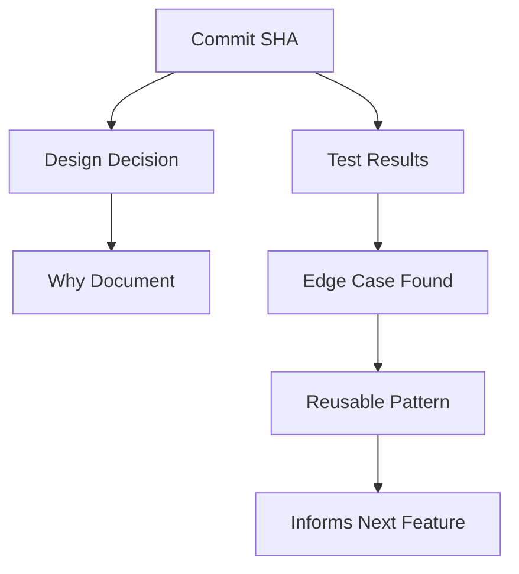

# Smart Iterative Coding: A Living Team Philosophy

> **"Build the castle brick by brick, with each brick tested before the next layer."**

## 🎯 Mission Statement

Smart Iterative Coding transforms software development from a series of big bangs into a continuous stream of micro-evolutions. Each change is intentional, testable, and reversible—creating psychological safety while accelerating delivery.

## 🧠 Core Philosophy

### The Three Pillars

1. **Smart**: Not just fast, but thoughtful. Each iteration has purpose.
2. **Iterative**: True agility through micro-steps, not giant leaps.
3. **Coding**: The craft remains central—we're building lasting systems.

### Cultural Shifts Required

| From | To |
|------|-----|
| "Does it run?" | "How will I know it's right?" |
| "I'll commit when done" | "Every passing test deserves a commit" |
| "Rollback = Failure" | "Rollback = Victory for process safety" |
| "Code then document" | "Documentation IS code" |

## 🔄 The Smart Iterative Loop

```
Think (5 min) → Test (Red) → Code (Green) → Refactor → Commit → Learn → Repeat
     ↑                                                                    ↓
     ←────────────── Rollback if needed (celebrate the save!) ──────────←
```

## 📋 Developer Daily Habits

### Every Developer Should:

1. **Write the test first** (or at minimum, before merging)
   ```bash
   # Before coding the feature
   npm test -- --watch user.validation.spec.ts
   ```

2. **Commit as soon as a logical step works**
   ```bash
   # After each micro-victory
   git add -p  # Review changes
   git commit -m "test: add email validation case"
   ```

3. **Push to shared branches daily**
   - No "dark work" hidden on local machines
   - Every push triggers automated checks

4. **Use pre-commit hooks** (non-negotiable)
   ```yaml
   # .pre-commit-config.yaml
   - id: lint
   - id: type-check
   - id: test-affected
   ```

5. **Document the "why" in commits**
   ```
   fix: prevent XSS in user input
   
   Previous regex allowed script tags through HTML entities.
   Added DOMPurify sanitization before validation.
   
   Rollback point: If sanitization breaks legitimate use cases
   ```

## 🧩 Team Rituals & Practices

### Daily Standups 2.0
Include: "What did I commit, and what did I learn?"

Example:
> "Yesterday I committed 5 micro-changes to the auth flow. Learned that our email regex was blocking valid '+' addresses. Already fixed and tested."

### Weekly Retrospectives
Focus on celebrating great saves:
- "Best rollback of the week" award
- "Smallest useful commit" recognition
- "Most helpful test" highlight

### Code Review as Knowledge Transfer
Reviews should ask:
- Why this approach over alternatives?
- What edge cases worried you?
- How would we know if this breaks?

## 💾 Memory & Knowledge Systems

### 1. Codebase Memory Graph



### 2. Living Documentation Structure

```
/docs
  /decisions
    - ADR-001-why-redis-for-sessions.md
    - ADR-002-rollback-payment-service.md
  /gotchas
    - email-validation-edge-cases.md
    - timezone-handling-lessons.md
  /patterns
    - async-error-handling.md
    - test-data-builders.md
  /rollbacks
    - 2024-01-15-auth-service-recovery.md
```

### 3. Embedded Knowledge Tools

```python
# Example: Auto-capture learning moments
@capture_learning
def validate_email(email: str) -> bool:
    """
    Validates email addresses.
    
    Learnings:
    - 2024-01-10: Added '+' support after user report
    - 2024-01-12: Unicode domains need punycode conversion
    """
    # Actual validation logic
```

## 🚀 Implementation Checklist

### Phase 1: Foundation (Week 1-2)
- [ ] Set up pre-commit hooks for all developers
- [ ] Create `/docs/decisions` directory structure
- [ ] Configure CI/CD for micro-commit support
- [ ] Write first GOTCHAS.md entry

### Phase 2: Habits (Week 3-4)
- [ ] Implement daily standup format change
- [ ] Run first "rollback celebration" retro
- [ ] Create commit message templates
- [ ] Set up team dashboard for iteration metrics

### Phase 3: Intelligence (Week 5-6)
- [ ] Deploy codebase search tool
- [ ] Create first knowledge graph visualization
- [ ] Implement @capture_learning decorators
- [ ] Set up automated pattern detection

### Phase 4: Culture (Ongoing)
- [ ] Monthly "Best Save" awards
- [ ] Quarterly documentation parties
- [ ] Semi-annual process evolution reviews
- [ ] Annual culture health checks

## 📊 Success Metrics

### Velocity Metrics
- **Commit Frequency**: Target 5+ commits/day/developer
- **Test Coverage Delta**: Always positive with each commit
- **Mean Time to Rollback**: < 5 minutes

### Quality Metrics
- **Lint Error Rate**: 0 on commit (enforced)
- **Type Error Rate**: 0 on commit (enforced)
- **Test Failure Recovery Time**: < 1 iteration

### Culture Metrics
- **Rollback Celebration Rate**: How often are rollbacks discussed positively?
- **Documentation Currency**: % of decisions documented within 24 hours
- **Knowledge Reuse**: How often do devs reference past learnings?

## 🎭 Storytelling Templates

### The Great Save Story
```markdown
## The Payment Gateway Rollback (2024-01-15)

**What Happened**: New payment validation blocked legitimate transactions
**How We Knew**: Monitoring showed 10x spike in failures within 2 minutes
**The Save**: Rolled back in 3 minutes, fixed with better test case
**What We Learned**: Always test with production-like data samples
**Changes Made**: Added anonymized prod data to test suite
```

### The Micro-Victory Log
```markdown
## Small Wins That Mattered

- **2024-01-20**: 5-line commit fixed 3-month-old bug
- **2024-01-21**: Test caught security issue before code review
- **2024-01-22**: Rollback prevented Black Friday outage
```

## 🤖 AI & Automation Allies

### Commit Assistant
```bash
# AI suggests commit message based on diff
git smart-commit

# Output: "refactor: extract email validation to pure function
#          
#          Moved validation logic from controller to utils.
#          Added comprehensive test cases for edge cases.
#          No behavioral changes."
```

### Pattern Recognition Bot
```python
# Watches for similar changes across codebase
@bot.on_commit
def suggest_patterns(commit):
    similar = find_similar_changes(commit.diff)
    if similar:
        notify(f"Similar to {similar.file}:{similar.line} - consider reusing pattern")
```

### Knowledge Graph Builder
```yaml
# Auto-builds relationships between code elements
on_merge:
  - extract_decisions_from_pr
  - link_tests_to_features
  - update_dependency_graph
  - notify_affected_teams
```

## 🔗 Integration Points

### With Existing Guidelines

**DEVELOPMENT_GUIDELINES.md**:
- Enhances "Plan Before You Code" with micro-planning
- Strengthens "Adopt a Functional, Test-Driven Mindset"
- Operationalizes "Iterate with Feedback Loops"

**CLAUDE.md Core Values**:
- **Planning**: Micro-planning for each iteration
- **Transparency**: Every commit tells a story
- **Quality**: Emerges from continuous micro-improvements
- **Collaboration**: Shared learning through documented saves

### With Development Tools

**Git Hooks** → Enforce standards
**CI/CD** → Validate every micro-step
**ChromaDB** → Store and search learnings
**Neo4j** → Visualize code evolution patterns

## 🌟 The Ultimate Goal

Transform your team into a learning organism where:
- Every commit teaches something
- Every rollback prevents future issues
- Every test documents intention
- Every developer feels safe to experiment

Remember: **We're not just writing code—we're evolving systems that teach us how to build better systems.**

---

*This is a living document. Update it with your team's learnings. The best process is the one that evolves with you.*

**Last Updated**: 2025-08-01
**Next Review**: Monthly at team retro