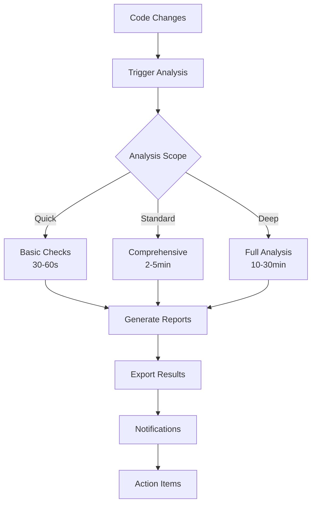

# System Architect Integration Guide

## 🎯 **Overview**

The System Architect Suite is an AI-powered architecture analysis and management system that continuously monitors, analyzes, and optimizes your trading system's architecture. This guide explains exactly how and when the System Architect runs, integrates with your development workflow, and provides actionable insights.

## 🔄 **How System Architect Works**

### **Core Workflow**



### **Analysis Pipeline**

1. **Project Scanning** - Discovers and catalogs all code components
2. **Architecture Analysis** - Maps system structure and relationships
3. **Dependency Analysis** - Detects circular dependencies and coupling issues
4. **Code Metrics** - Measures complexity, maintainability, and quality
5. **Security Audit** - Scans for vulnerabilities and security risks
6. **Performance Analysis** - Identifies bottlenecks and optimization opportunities
7. **Migration Planning** - Plans for version upgrades and framework changes
8. **Health Assessment** - Generates overall system health score
9. **Report Generation** - Creates detailed reports and actionable recommendations

## ⏰ **When System Architect Runs**

### **1. Continuous Integration (CI/CD) Integration**

#### **Pre-commit Hook** (30-60 seconds)
```bash
# Automatically runs on every commit
git commit -m "your changes"
# Triggers: Quick scope analysis
# Focus: Security vulnerabilities, basic complexity checks
# Output: Pass/fail for quality gates
```

**What it analyzes:**
- Changed files only
- Security vulnerability scanning
- Basic complexity thresholds
- Code smell detection
- Critical quality gates

**Example Output:**
```
System Architect - Pre-commit Analysis
=====================================
Files Analyzed: 3
Security Issues: 1 (CRITICAL - hardcoded API key)
Complexity Issues: 0
Quality Gate: FAILED
Action Required: Fix security issue before commit
```

#### **Pull Request Analysis** (2-5 minutes)
```bash
# Runs automatically on PR creation/update
git push origin feature/new-agent
# Triggers: Standard scope analysis
# Focus: Comprehensive feature impact assessment
# Output: Detailed PR analysis report
```

**What it analyzes:**
- All files in the feature branch
- Cross-component impact analysis
- Dependency changes and circular dependencies
- Test coverage impact
- Performance implications
- Security audit of new code

**Example Integration:**
```yaml
# .github/workflows/system-architect.yml
name: System Architect Analysis
on:
  pull_request:
    branches: [ main, develop ]

jobs:
  architecture-analysis:
    runs-on: ubuntu-latest
    steps:
      - uses: actions/checkout@v2
      - name: System Architect Analysis
        run: |
          python -m system_architect.analyze --scope standard --export json,html
          python -m system_architect.report --pr-comment
```

#### **Nightly Build Analysis** (10-30 minutes)
```bash
# Runs every night via cron job
0 2 * * * /usr/bin/python -m system_architect.analyze --scope comprehensive
# Triggers: Comprehensive scope analysis
# Focus: Full system health assessment
# Output: Complete architecture health report
```

**What it analyzes:**
- Entire codebase comprehensive analysis
- Historical trend analysis
- Architecture evolution tracking
- Performance benchmarking
- Security compliance checking
- Technical debt assessment

#### **Release Preparation Analysis** (30-60 minutes)
```bash
# Manual trigger before major releases
python -m system_architect.analyze --scope deep --migration-planning
# Triggers: Deep scope analysis
# Focus: Release readiness assessment
# Output: Go/no-go recommendation with detailed analysis
```

### **2. Development Workflow Integration**

#### **IDE Integration**
```python
# VS Code Extension: System Architect
# Real-time analysis as you type
# Immediate feedback on:
# - Complexity increases
# - Security issues
# - Architecture violations
# - Code quality degradation
```

#### **Local Development**
```bash
# Manual execution during development
cd trading_system
python run_system_architect_simple.py

# Quick health check
python -m system_architect.quick-check

# Focus analysis on specific component
python -m system_architect.analyze --component agents/ml_ensemble
```

### **3. Automated Triggers**

#### **Threshold-Based Triggers**
- **Complexity Threshold Exceeded**: Automatic analysis when cyclomatic complexity > 15
- **Security Alert**: Immediate scan when security patterns detected
- **Dependency Changes**: Analysis when new dependencies added
- **Coverage Drop**: Review when test coverage decreases > 5%

#### **Event-Driven Triggers**
- **New Agent Added**: Full integration analysis
- **Framework Upgrade**: Migration impact assessment
- **Production Incident**: Emergency health check
- **Performance Regression**: Bottleneck identification

## 🏗️ **Integration Scenarios**

### **Scenario 1: New Feature Development**

```bash
# 1. Developer starts new feature
git checkout -b feature/risk-optimization

# 2. During development - IDE provides real-time feedback
# - Code complexity warnings
# - Security issue alerts
# - Architecture compliance checks

# 3. Before commit - Pre-commit hook runs
git commit -m "implement risk optimization algorithm"
# System Architect Quick Analysis:
# ✓ No security issues
# ✓ Complexity within limits  
# ⚠ Warning: New circular dependency detected
# Action: Review dependency structure

# 4. Push to remote - PR analysis triggered
git push origin feature/risk-optimization
# System Architect Standard Analysis:
# - Impact on overall system architecture
# - Performance implications of new algorithm
# - Test coverage assessment
# - Integration with existing risk management

# 5. PR Review - Architecture team reviews analysis report
# Recommendations:
# - Break circular dependency using dependency injection
# - Add unit tests for new algorithm (coverage: 45% -> target: 80%)
# - Consider caching for performance optimization

# 6. Merge to main - Triggers comprehensive analysis
# Full system health reassessment
# Updated architecture diagrams
# Migration plan updates
```

### **Scenario 2: Production Deployment**

```bash
# 1. Pre-deployment analysis
python -m system_architect.analyze --scope deep --export all
# Generates:
# - Comprehensive health report
# - Security compliance verification
# - Performance benchmarks
# - Rollback procedures

# 2. Deployment readiness check
# Health Score: 85/100 (Good - Deploy Ready)
# Critical Issues: 0
# High Priority Issues: 2 (addressed in post-deployment plan)
# Performance: Within acceptable parameters
# Security: All critical vulnerabilities resolved

# 3. Post-deployment monitoring
# Continuous health monitoring
# Performance trend analysis
# Security posture assessment
# Architecture evolution tracking
```

### **Scenario 3: System Maintenance**

```bash
# Weekly Architecture Review
python -m system_architect.weekly-report
# Generates:
# - Health trend analysis
# - Technical debt assessment
# - Security posture review
# - Performance optimization opportunities

# Monthly Deep Analysis
python -m system_architect.analyze --scope comprehensive --historical
# Includes:
# - Month-over-month health comparison
# - Architecture evolution analysis
# - Emerging technical debt identification
# - Proactive improvement recommendations
```

## 📊 **Analysis Scopes Detailed**

### **Quick Scope** (30-60 seconds)
**When Used:** Pre-commit hooks, quick checks during development
**Coverage:** Changed files only
**Analysis Includes:**
- Security vulnerability scanning (critical and high severity)
- Basic complexity analysis (functions exceeding threshold)
- Code smell detection (major violations)
- Import validation (circular import detection)
- Quality gate validation

**Output Example:**
```
QUICK ANALYSIS RESULTS
====================
Files Scanned: 3
Security Issues: 0
Complexity Issues: 1 (function exceeds 15 complexity)
Code Smells: 2 (long parameter lists)
Quality Gate: PASSED
Execution Time: 45 seconds
```

### **Standard Scope** (2-5 minutes)
**When Used:** Pull request analysis, feature validation
**Coverage:** Feature branch or specified components
**Analysis Includes:**
- Complete security audit (all severity levels)
- Comprehensive complexity analysis
- Dependency analysis with circular dependency detection
- Test coverage assessment
- Performance bottleneck identification
- Architecture compliance checking

**Output Example:**
```
STANDARD ANALYSIS RESULTS
========================
Files Analyzed: 15
Lines of Code: 5,247
Overall Complexity: 8.2/10 (Good)
Security Score: 78/100 (Good)
Test Coverage: 67% (Below target 80%)
Circular Dependencies: 1 (risk_manager -> portfolio_manager -> risk_manager)
Performance Issues: 2 (minor)
Architecture Compliance: 85% (Good)
```

### **Comprehensive Scope** (10-30 minutes)
**When Used:** Nightly builds, release preparation, monthly reviews
**Coverage:** Entire codebase
**Analysis Includes:**
- Full system architecture analysis
- Complete security audit with compliance checking
- Performance profiling and optimization recommendations
- Technical debt assessment
- Migration readiness evaluation
- Historical trend analysis
- Cross-component validation

**Output Example:**
```
COMPREHENSIVE ANALYSIS RESULTS
=============================
Project Health Score: 82.5/100 (Good)
Total Files: 78
Total Lines: 38,438
Components Analyzed: 42 agents + 36 modules

Architecture Health:
- Component Coupling: 4.2 (Acceptable)
- Stability Index: 0.68 (Good)
- Modularity Score: 87/100 (Excellent)

Security Assessment:
- Vulnerabilities: 3 (0 critical, 1 high, 2 medium)
- Compliance Score: 89/100 (Good)
- Security Trend: Improving (+5 points this month)

Performance Profile:
- Critical Bottlenecks: 0
- Optimization Opportunities: 8
- Memory Efficiency: 85/100 (Good)

Recommendations:
1. Address high-severity SQL injection vulnerability in test code
2. Increase test coverage from 67% to target 80%
3. Refactor 3 high-complexity functions
4. Consider migration to Python 3.11 for performance benefits
```

### **Deep Scope** (30-60 minutes)
**When Used:** Release preparation, quarterly reviews, major refactoring
**Coverage:** Complete system with historical and predictive analysis
**Analysis Includes:**
- All comprehensive scope analysis
- Predictive architecture modeling
- Migration planning and impact assessment
- Compliance and regulatory analysis
- Business impact assessment
- ROI analysis for recommended improvements
- Detailed remediation roadmaps

## 🚀 **Integration Best Practices**

### **1. CI/CD Pipeline Integration**

```yaml
# Complete CI/CD Integration Example
stages:
  - pre-commit
  - build
  - test
  - architecture-analysis
  - security-scan
  - deploy

architecture-analysis:
  stage: architecture-analysis
  script:
    - python -m system_architect.analyze --scope standard --format json
    - python -m system_architect.quality-gate --threshold 75
  artifacts:
    reports:
      junit: system_architect_report.xml
    paths:
      - architecture_analysis.json
      - architecture_report.html
  only:
    - merge_requests
    - main
    - develop
```

### **2. Quality Gates Configuration**

```python
# quality_gates.py
QUALITY_GATES = {
    'health_score': {
        'minimum': 75,
        'blocking': True  # Blocks deployment if not met
    },
    'security_score': {
        'minimum': 80,
        'blocking': True
    },
    'complexity_threshold': {
        'maximum': 15,
        'blocking': False  # Warning only
    },
    'test_coverage': {
        'minimum': 80,
        'blocking': True
    },
    'circular_dependencies': {
        'maximum': 0,
        'blocking': True
    }
}
```

### **3. Notification Configuration**

```python
# notifications.py
NOTIFICATION_CONFIG = {
    'channels': {
        'slack': {
            'webhook_url': 'https://hooks.slack.com/...',
            'channels': {
                'critical': '#architecture-alerts',
                'warnings': '#development',
                'info': '#architecture-reports'
            }
        },
        'email': {
            'smtp_server': 'smtp.company.com',
            'recipients': {
                'critical': ['architect@company.com', 'cto@company.com'],
                'warnings': ['dev-team@company.com'],
                'reports': ['architecture-team@company.com']
            }
        }
    },
    'triggers': {
        'health_score_drop': {
            'threshold': 10,  # 10 point drop triggers alert
            'severity': 'warning'
        },
        'security_vulnerability': {
            'critical': 'critical',
            'high': 'warning',
            'medium': 'info'
        },
        'architecture_violation': 'warning'
    }
}
```

## 📈 **Monitoring and Dashboards**

### **Real-time Health Dashboard**

```python
# health_dashboard.py
class ArchitectureHealthDashboard:
    def __init__(self):
        self.metrics = {
            'current_health_score': 82.5,
            'trend': '+2.1 (7 days)',
            'critical_issues': 0,
            'warnings': 3,
            'last_analysis': '2025-07-27 20:31:25',
            'next_analysis': '2025-07-28 02:00:00'
        }
    
    def get_health_status(self):
        return {
            'status': 'Good',
            'score': self.metrics['current_health_score'],
            'trend': self.metrics['trend'],
            'last_updated': self.metrics['last_analysis']
        }
```

### **Trend Analysis**

```python
# Track architecture evolution over time
HEALTH_HISTORY = [
    {'date': '2025-07-01', 'score': 75.2, 'security': 65, 'complexity': 70},
    {'date': '2025-07-15', 'score': 79.8, 'security': 78, 'complexity': 72},
    {'date': '2025-07-27', 'score': 82.5, 'security': 82, 'complexity': 68},
]

# Predictive modeling
def predict_health_trend(history, weeks_ahead=4):
    # ML model predicts future health score based on trends
    # Helps with proactive architecture management
    pass
```

## 🎯 **Actionable Outputs**

### **1. Immediate Actions (Critical)**
- Security vulnerabilities requiring immediate patching
- Circular dependencies breaking system stability
- Performance bottlenecks affecting user experience
- Critical compliance violations

### **2. Short-term Improvements (1-4 weeks)**
- Code complexity reduction through refactoring
- Test coverage improvements
- Architecture pattern compliance
- Technical debt reduction

### **3. Strategic Initiatives (1-6 months)**
- System migration planning
- Architecture evolution roadmap
- Performance optimization programs
- Security hardening initiatives

## 🔧 **Customization and Extension**

### **Custom Analysis Agents**

```python
# custom_analysis_agent.py
from system_architect.base import BaseAnalysisAgent

class CustomBusinessLogicAgent(BaseAnalysisAgent):
    def analyze(self, codebase):
        # Custom business logic analysis
        # Domain-specific architecture patterns
        # Trading system specific validations
        pass
```

### **Custom Quality Gates**

```python
# custom_quality_gates.py
def trading_system_quality_gate(analysis_results):
    """Custom quality gate for trading system"""
    
    # Trading-specific requirements
    if analysis_results.get('latency_analysis', {}).get('max_latency', 0) > 100:
        return False, "Trading latency exceeds 100ms limit"
    
    if analysis_results.get('data_accuracy', 0) < 99.9:
        return False, "Data accuracy below required 99.9%"
    
    return True, "Trading system quality requirements met"
```

## 📚 **Training and Adoption**

### **Team Training Program**

1. **Week 1: Introduction**
   - System Architect overview and capabilities
   - Integration with existing workflow
   - Basic analysis interpretation

2. **Week 2: Hands-on Practice**
   - Running analyses on sample code
   - Interpreting reports and recommendations
   - Quality gate configuration

3. **Week 3: Advanced Features**
   - Custom analysis configuration
   - Advanced reporting and dashboards
   - Integration with external tools

4. **Week 4: Best Practices**
   - Workflow optimization
   - Proactive architecture management
   - Continuous improvement processes

### **Success Metrics**

- **Adoption Rate**: 90% of developers using System Architect regularly
- **Issue Prevention**: 75% reduction in architecture-related bugs
- **Code Quality**: Sustained health score > 85
- **Development Velocity**: Maintained or improved delivery speed
- **Technical Debt**: 50% reduction in technical debt over 6 months

---

## 🎉 **Conclusion**

The System Architect Suite transforms architecture management from reactive to proactive, providing continuous insights and automated optimization recommendations. By integrating seamlessly into your development workflow, it ensures your trading system maintains high quality, security, and performance standards while evolving rapidly.

**Key Benefits:**
- ⚡ **Faster Development**: Automated architecture validation and feedback
- 🔒 **Enhanced Security**: Continuous vulnerability detection and remediation
- 📈 **Improved Quality**: Sustained high code quality and maintainability
- 🎯 **Reduced Risk**: Proactive identification and mitigation of architecture issues
- 💰 **Cost Savings**: Prevention of costly architecture failures and technical debt

**Ready to get started?** Run your first analysis:
```bash
python run_system_architect_simple.py
```

---

**Last Updated:** July 27, 2025  
**Version:** 2.0.0  
**Status:** Production Ready ✅