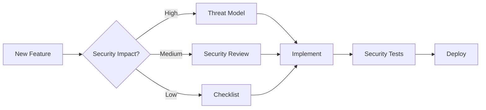

# Universal Security-by-Design Framework

## 🎯 Core Principle: Security is NOT a Feature - It's the Foundation

### **Phase 0: Pre-Project Security Questions**

Before writing ANY code or choosing ANY technology:

1. **Data Classification**
   - What types of data will this system handle?
   - What's the worst-case scenario if this data is exposed?
   - Who are the threat actors?

2. **Trust Boundaries**
   - Where does trusted data become untrusted?
   - What are the system's entry/exit points?
   - Who/what do we trust and why?

3. **Compliance Requirements**
   - What regulations apply? (GDPR, HIPAA, PCI-DSS, etc.)
   - What are the legal consequences of a breach?
   - What audit requirements exist?

### **Phase 1: Architecture Security Patterns**

Choose patterns BEFORE implementation:

```
┌─────────────────────────────────────────┐
│         SECURITY DECISION TREE          │
├─────────────────────────────────────────┤
│                                         │
│  Is this system public-facing?          │
│           ├─ Yes → Zero Trust Model     │
│           └─ No → Defense in Depth      │
│                                         │
│  Does it handle sensitive data?         │
│           ├─ Yes → Encryption First     │
│           └─ No → Privacy by Design     │
│                                         │
│  Multi-user system?                     │
│           ├─ Yes → RBAC/ABAC Required   │
│           └─ No → Principle of Least    │
│                                         │
└─────────────────────────────────────────┘
```

### **Universal Security Design Principles**

#### 1. **Assume Breach**
- Design as if attackers are already inside
- Every component must verify, never trust
- Plan incident response from day one

#### 2. **Shift Security Left**
```
Traditional: Design → Build → Test → Secure → Deploy
Secure:      Secure → Design → Build → Test → Deploy
```

#### 3. **Security as Code**
- Security requirements in version control
- Automated security testing in CI/CD
- Infrastructure security as configuration

### **Technology-Agnostic Security Checklist**

#### **Planning Phase** ✓
- [ ] Threat model created (STRIDE/PASTA)
- [ ] Data flow diagrams with trust boundaries
- [ ] Security requirements documented
- [ ] Compliance requirements identified
- [ ] Security champion assigned

#### **Design Phase** ✓
- [ ] Authentication strategy chosen
- [ ] Authorization model defined
- [ ] Encryption strategy (at-rest, in-transit)
- [ ] Input validation approach
- [ ] Output encoding strategy
- [ ] Error handling philosophy
- [ ] Logging and monitoring plan
- [ ] Incident response playbook

#### **Implementation Phase** ✓
- [ ] Secure coding standards adopted
- [ ] Dependency scanning configured
- [ ] Secret management solution
- [ ] Security headers/configurations
- [ ] Rate limiting strategy
- [ ] CORS/CSP policies defined

#### **Verification Phase** ✓
- [ ] SAST (Static Analysis) tools
- [ ] DAST (Dynamic Analysis) tools
- [ ] Dependency vulnerability scanning
- [ ] Penetration testing plan
- [ ] Security review gates

### **Security Architecture Patterns**

#### **Pattern 1: Zero Trust Architecture**
```yaml
principles:
  - Never trust, always verify
  - Least privilege access
  - Assume breach
  
implementation:
  - Mutual TLS everywhere
  - Service mesh with security policies
  - Identity-based access control
  - Micro-segmentation
```

#### **Pattern 2: Defense in Depth**
```yaml
layers:
  1. Perimeter Security
  2. Network Security  
  3. Host Security
  4. Application Security
  5. Data Security
  
principle: If one layer fails, others protect
```

#### **Pattern 3: Privacy by Design**
```yaml
core_concepts:
  - Data minimization
  - Purpose limitation
  - Consent management
  - Right to erasure
  
implementation:
  - Pseudonymization
  - Data retention policies
  - Audit trails
  - Privacy impact assessments
```

### **Security Decision Framework**

For EVERY feature/component, ask:

1. **STRIDE Analysis**
   - **S**poofing: Can someone pretend to be someone else?
   - **T**ampering: Can data be maliciously modified?
   - **R**epudiation: Can actions be denied?
   - **I**nformation Disclosure: Can data leak?
   - **D**enial of Service: Can service be disrupted?
   - **E**levation of Privilege: Can permissions be escalated?

2. **SECURITY TRIAD**
   - **Confidentiality**: Is data protected from unauthorized access?
   - **Integrity**: Is data protected from unauthorized modification?
   - **Availability**: Is the service resilient to attacks?

### **Project-Type Security Templates**

#### **Web Application**
```yaml
mandatory:
  - HTTPS everywhere
  - Security headers (CSP, HSTS, etc.)
  - Input validation framework
  - Session management
  - CSRF protection
  - XSS prevention
```

#### **API/Microservices**
```yaml
mandatory:
  - API authentication (OAuth2/JWT)
  - Rate limiting
  - Input validation
  - API versioning
  - Service-to-service auth
  - Circuit breakers
```

#### **Mobile Application**
```yaml
mandatory:
  - Certificate pinning
  - Secure storage
  - Code obfuscation
  - Anti-tampering
  - Secure communication
  - Biometric authentication
```

#### **IoT/Embedded**
```yaml
mandatory:
  - Secure boot
  - Firmware signing
  - Update mechanism
  - Minimal attack surface
  - Hardware security module
  - Device authentication
```

### **Security Metrics for Any Project**

Track from day one:

1. **Design Metrics**
   - % of components threat modeled
   - Number of trust boundaries identified
   - Security requirements coverage

2. **Implementation Metrics**
   - % of code covered by security tests
   - Number of security anti-patterns found
   - Dependency vulnerability count

3. **Runtime Metrics**
   - Mean time to detect (MTTD)
   - Mean time to respond (MTTR)
   - False positive rate
   - Security incident frequency

### **Universal Security Mantras**

1. **"Never roll your own crypto"**
2. **"Validate input, encode output"**
3. **"Fail closed, not open"**
4. **"Log everything, trust nothing"**
5. **"Secrets are never in code"**
6. **"Every door needs a lock"**
7. **"Security is everyone's job"**

### **Universal Coding Rules**

1. **"No Unicode in print statements"** - Use ASCII ([OK], [ERROR], [SUCCESS]) for Windows compatibility
2. **"Environment files never in git"** - Always .gitignore .env files
3. **"Secrets in environment variables only"** - Never hardcode API keys
4. **"Type hints everywhere"** - Improves maintainability and catches errors
5. **"Fail fast with clear messages"** - Don't hide errors, make them obvious

### **Security-First Development Workflow**



---

## 🚀 Quick Start for Any New Project

1. **Copy this template**
2. **Answer Phase 0 questions**
3. **Choose security patterns**
4. **Create threat model**
5. **Implement with security-first mindset**

Remember: **Security delayed is security denied**